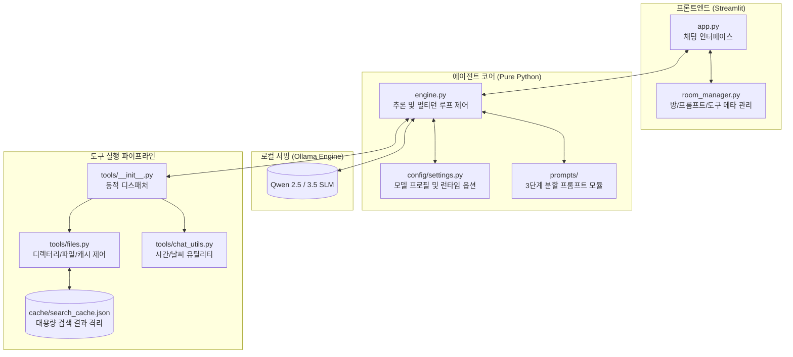

# Local Agent: 프라이버시 중심의 경량 온프레미스 AI 에이전트 시스템

[](https://www.python.org/)
[](https://ollama.com/)
[](https://streamlit.io/)
[](LICENSE)

로컬 하드웨어(VRAM) 제약 환경에서 데이터 외부 유출 없이 로컬 PC 파일 시스템 제어 및 일상 작업을 자율 수행하는 **온프레미스(On-Premise) sLLM 기반 AI 에이전트 시스템**입니다.

상용 클라우드 LLM API의 토큰 과금과 사내 민감 데이터 유출 리스크를 해소하기 위해 기획되었으며, 순수 Python 기반의 경량 에이전트 런타임과 도구 바인딩(Tool Binding), 계층적 탐색(Tree-of-Thought) 추론 체계를 구현했습니다.

---

## 📌 주요 특징 (Key Highlights)

- **데이터 주권 및 비용 제로**: 외부 클라우드 통신 없이 로컬 환경(Ollama)에서 모델 추론 및 파일 시스템 제어를 완결하여 기밀 데이터 유출 방지 및 API 호출 비용 원천 차단
- **하드웨어 제약 기반 모델 최적화**: VRAM 스왑 및 추론 지연을 방지하기 위해 체급 최적화(Qwen 14B ➔ 9B)를 단행하여 단일 GPU에서 쾌적한 턴어라운드 타임 확보
- **컨텍스트 격리 캐싱 아키텍처**: 수천 개의 파일 검색 결과로 인한 컨텍스트 윈도우 오버플로우를 막기 위해 검색 원본은 로컬 파일에 격리하고, 에이전트에는 통계 메타데이터만 전달하는 파이프라인 구축
- **환각 및 과잉 도구 호출 방어 (Over-tooling 방지)**: SLM 특유의 도구 호출 편향과 가짜 경로 생성(Hallucination)을 막기 위한 행동 동사 기반 스키마 노출 제어 및 안전 덮어쓰기 방어 로직 구현
- **모듈화된 프롬프트 & 멀티 룸 관리**: 페르소나, 일반 대화, 파일 제어 프롬프트를 분리하고, 채팅방별 독립된 도구와 페르소나를 동적으로 장착하는 룸 관리 시스템 구축

---

## 🛠️ 시스템 아키텍처 및 디렉토리 구조

### 시스템 아키텍처



### 디렉토리 구조

```
LocalAgent/
├── app.py                     # Streamlit 기반 웹 인터페이스 및 세션 관리
├── engine.py                  # Ollama 연동 추론, 멀티턴 루프 및 응답 정제 엔진
├── room_manager.py            # 방(Room) 단위 프롬프트/도구 동적 장착 및 관리 모듈
├── agent.py                   # 터미널 기반 CLI 에이전트 런타임
├── requirements.txt           # 프로젝트 의존성 목록
├── cache/
│   └── search_cache.json      # 대용량 검색 결과 격리용 로컬 캐시
├── config/
│   ├── categories.py          # 파일 확장자 및 카테고리 매핑 규칙
│   ├── settings.py            # 모델 프로필, 파라미터, 런타임 환경 설정
│   └── settings.py.example    # 설정 예시 템플릿
├── prompts/                   # 3단계 모듈형 프롬프트
│   ├── 01_persona.md          # 에이전트 정체성 및 말투
│   ├── 02_chat.md             # 일상 대화 및 상호작용 규칙
│   └── 03_files.md            # 파일 시스템 제어 및 계층 탐색(ToT) 규칙
└── tools/                     # Function Calling 도구 패키지
    ├── __init__.py            # 스키마 통합(`ALL_SCHEMAS`) 및 동적 디스패처
    ├── files.py               # 파일/폴더 검색, 선별 저장, 휴지통 제어 도구
    └── chat_utils.py          # 시간, 날씨 등 대화형 보조 도구
```

## ⚙️ 주요 기능
### 1. 지능형 파일 시스템 제어
- 계층적 탐색(Tree-of-Thought): 디스크 루트 전수 조사를 지양하고, search_folders로 상위 구조 파악 후 유력 폴더만 정밀 탐색하는 3단계 자율 추론 전략 적용
- 대용량 파일 검색 및 선별 저장: 용량 범위(min_size_mb, max_size_mb) 필터링을 지원하며, 5만 개 스캔 한도 도달 시 에이전트가 스스로 하위 경로를 좁혀 재탐색
- 데이터 안전 파이프라인: 파일 덮어쓰기 사고를 방지하기 위해 연속 쓰기 차단 및 파일명 자동 넘버링((1), (2)) 유틸리티 적용

### 2. 모듈형 방(Room) 관리 및 동적 툴 바인딩
- 독립 세션 제어: 목적별로 방을 생성하고, 방마다 필요한 프롬프트와 도구 스키마(ALL_SCHEMAS, CHAT_SCHEMAS)를 독립 주입
- 채팅 전용 도구 셋 분리: 일상 잡담 방에서 모델의 억지 도구 호출을 막기 위해 파일 제어 권한을 배제하고 시간/날씨 등의 기본 유틸리티만 바인딩

### 3. 무중단 런타임 제어
- CLI/UI 모델 스위칭: 대화 맥락을 유지한 상태에서 런타임에 모델 프로필(/model)을 즉시 교체 가능
- 응답 후처리 파이프라인: 추론 모델(DeepSeek/Qwen 계열)의 `<think>` 사고 과정 태그 및 자가 역할극 찌꺼기를 정규식 기반으로 자동 정제하여 사용자에게 전달

## 💡 핵심 엔지니어링 문제 해결 (Troubleshooting)
### 1. 대용량 파일 검색 시 컨텍스트 윈도우 폭주 해결
- 문제: 하드디스크 탐색 시 수백 개의 경로 문자열이 한 번에 유입되어 모델의 컨텍스트 윈도우 한도를 초과하고 극심한 응답 지연 및 가짜 경로 환각이 발생함.

- 해결: 검색 결과 원본을 로컬 캐시(.search_cache.json)에 격리 저장하고, LLM에는 발견 건수 등 최소 메타데이터만 반환하도록 경량화함. 전체 저장이 필요할 때는 백엔드가 캐시 파일에서 원본을 직접 꺼내 출력하는 전용 파이프라인을 구축함.

### 2. 하드웨어(VRAM) 병목에 따른 모델 체급 최적화
- 문제: 초기 Qwen 2.5 14B 구동 시 16GB VRAM 한도를 초과하여 시스템 RAM으로 오프로딩(Offloading)이 발생, 토큰 생성 속도가 실사용 불가능한 수준으로 저하됨.

- 해결: 양자화 및 파라미터 벤치마킹을 거쳐 Qwen 3.5 9B 체급으로 전환, VRAM 점유율을 약 50% 수준으로 억제하여 안정적인 추론 속도 및 멀티턴 컨텍스트 유지 공간을 확보함.

### 3. 챗 템플릿 불일치로 인한 응답 지연 및 침묵 현상
- 문제: 잡담 모드에서 도구를 완전히 배제(tools=None)했을 때, 특정 SLM의 시스템 프롬프트 및 챗 템플릿 규격 불일치로 모델이 본문을 생성하지 못하고 `<think>` 태그 내부에 갇히거나 무한 루프에 빠짐.

- 해결: 빈 더미 도구 대신 기본 유틸리티 도구(chat_utils)를 항상 주입하여 스키마 구조의 일관성을 유지하고, 불필요한 호출 편향을 방지하기 위해 프롬프트 행동 수칙을 정밀 튜닝함.

### 4. 사전 학습된 '파일 쓰기 반사'로 인한 덮어쓰기 사고 방어
- 문제: 검색 결과 저장 도구를 호출한 직후, LLM이 과거 학습 데이터의 습관대로 범용 write_file 도구를 연달아 호출하여 방금 저장한 파일을 빈 내용으로 덮어쓰는 이상 동작 발생.

- 해결: 도구 스키마의 역할 분리를 명확히 하고, 코드 레벨에서 동일 경로에 대한 비정상적인 연속 쓰기 요청을 탐지하여 강제 차단하는 안전 가드레일을 구축함.

## 🚀 시작하기
- 요구 사양
    - Python 3.10+
    - Ollama 런타임
    - 권장 GPU: VRAM 12GB 이상 (8B~9B 모델 기준)

## 설치 및 환경 설정
```Bash
# 1. 저장소 클론
git clone [https://github.com/YOUR_USERNAME/LocalAgent.git](https://github.com/YOUR_USERNAME/LocalAgent.git)
cd LocalAgent

# 2. 가상환경 구성
python -m venv .venv
source .venv/bin/activate  # Windows: .\.venv\Scripts\Activate.ps1

# 3. 패키지 설치
pip install -r requirements.txt

# 4. 설정 파일 준비
cp config/settings.py.example config/settings.py
```

## 로컬 LLM 서빙 (Ollama)
```Bash
ollama pull qwen2.5:14b  # 또는 설정한 경량 모델 풀
```

## 실행
```Bash
# Web UI 인터페이스 실행 (Streamlit)
streamlit run app.py

# 또는 터미널 CLI 에이전트 실행
python agent.py
```

## 🗺️ 향후 로드맵 (Roadmap)
- 동적 도구 노출 (Dynamic Tool Exposure): 사용자 입력의 의도를 1차 판별하여 잡담 시 도구 스키마를 완전히 숨기는 로어북(Lorebook) 방식 적용

- Human-in-the-Loop (승인 인터랙션): 영구 삭제, 외부 수정 등 위험 작업 실행 전 UI 팝업을 통한 사용자 명시적 승인 절차 추가

- 대화 컨텍스트 영속화 및 메모리 요약: 방별 대화 내역의 DB 적재 및 슬라이딩 윈도우 기반 자동 요약 메모리 파이프라인 도입

- 프레임워크 확장성 검토: 로컬 문서 색인(RAG) 및 벡터 임베딩 결합 시 LangChain/LlamaIndex 프레임워크 점진적 마이그레이션